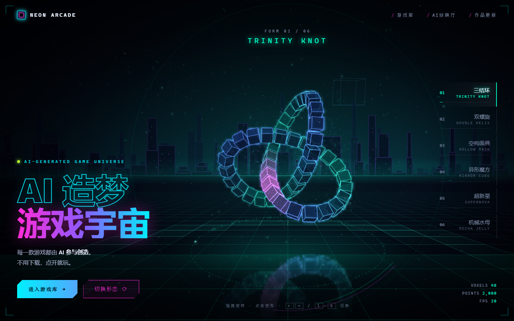
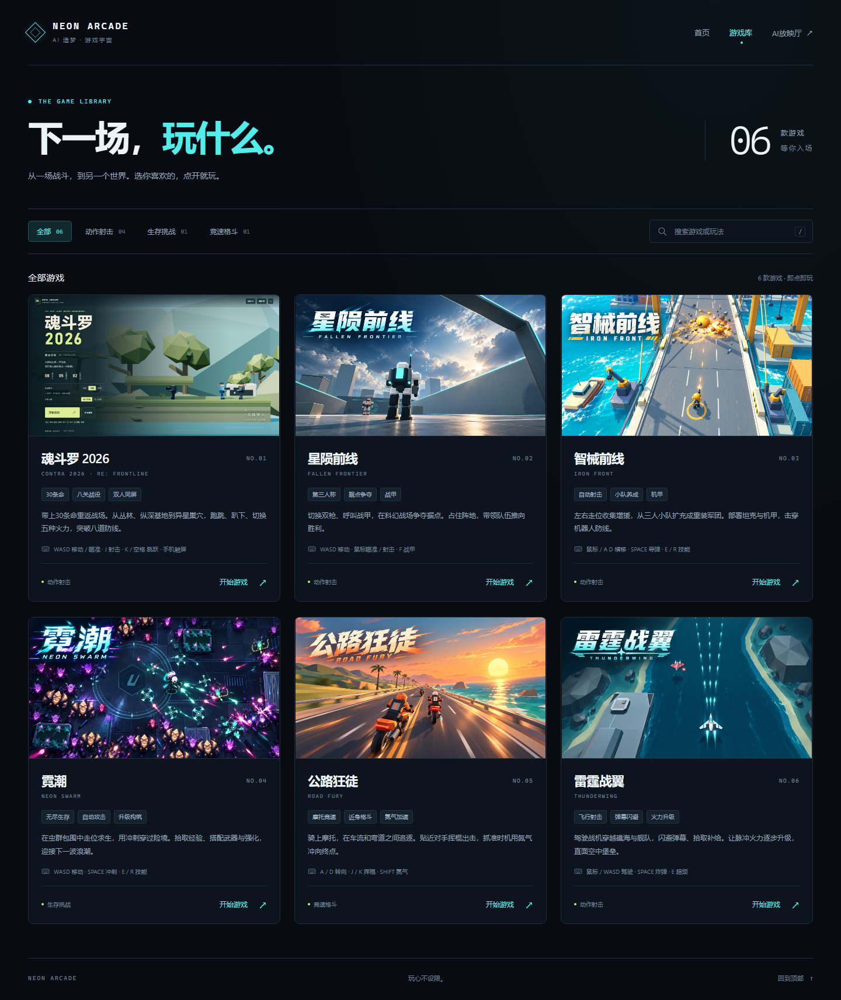
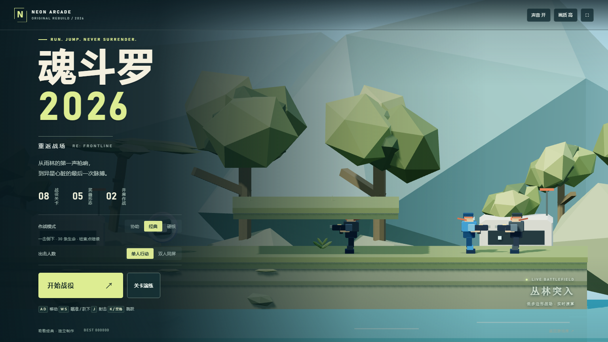
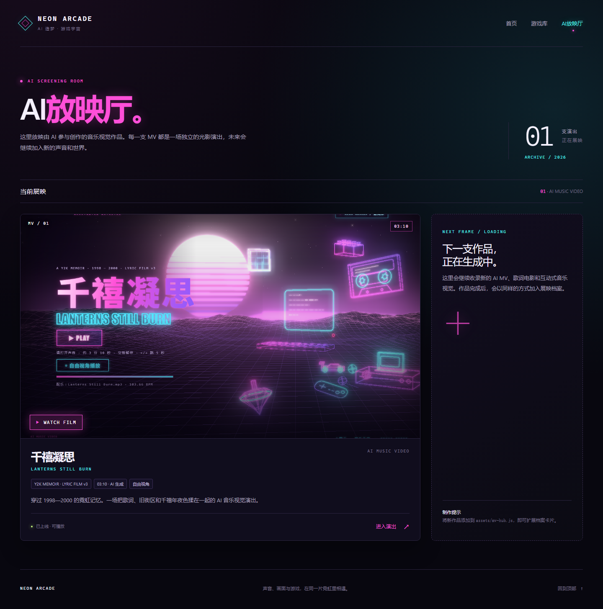

> 🤝 联系与交流可找 [颜](https://github.com/yan9651688) 和 [蓝梦](https://github.com/lanmengSakura)。

<div align="center">

# NEON ARCADE · AI 小游戏游戏厅

**打开网页，挑一款游戏，免费开玩。**

6 款小游戏 · AI 放映厅 · PC 与手机 · 无需登录

[](https://game.yituohub.com/)
[](LICENSE)
[](#-游戏库)
[](#-本地运行)
[](#-一起加新游戏)

</div>

---

这里放着我们做的几款 AI 小游戏。首页沿用设计师的新稿，保留霓虹街机的气氛，点击「游戏库」就能选游戏。没有账号、登录和付费步骤，游戏在你的浏览器里运行。

首页的「AI 放映厅」收录《千禧凝思》。想歇一会儿，可以进去看一场音乐视觉演出，再回游戏厅继续玩。

## 🌐 在线开玩

**[https://game.yituohub.com/](https://game.yituohub.com/)**

电脑使用键盘和鼠标，手机使用游戏内的触屏操作。具体按键以各款游戏的开始页或暂停菜单为准，手机横屏通常能看到更完整的战场。

从游戏库进入游戏，会先看到统一加载页。开始后可通过右侧「游戏库」返回选游戏；鼠标被游戏锁定时，先按 Esc 释放鼠标。影片可以返回 AI 放映厅，放映厅和游戏库都能回首页。

## 👀 看看游戏厅

<table>
<tr>
<td width="50%" align="center"><br><sub><b>霓虹首页 · 游戏库与 AI 放映厅</b></sub></td>
<td width="50%" align="center"><br><sub><b>游戏库 · 游戏封面、分类筛选与搜索</b></sub></td>
</tr>
</table>

## 🎮 游戏库

| 游戏 | 玩什么 |
| --- | --- |
| [魂斗罗 2026](https://game.yituohub.com/play.html?game=contra-2026) | 30 条命、八关战役、八向射击与双人同屏，支持手机触控 |
| [星陨前线](https://game.yituohub.com/play.html?game=fallen-frontier) | 第三人称科幻占点战场，枪械与战甲作战 |
| [智械前线](https://game.yituohub.com/play.html?game=iron-front) | 扩军、拾取军械与重装，突破机器人防线 |
| [霓潮](https://game.yituohub.com/play.html?game=neon-swarm) | 在敌潮中生存，升级武器与技能，继续挑战无尽模式 |
| [公路狂徒](https://game.yituohub.com/play.html?game=road-fury) | 骑摩托追逐、挥棍格斗，抓准时机用氮气加速 |
| [雷霆战翼](https://game.yituohub.com/play.html?game=thunderwing) | 驾驶战机穿越航线，拾取补给并升级火力 |

游戏库与加载页共用 [游戏清单](public/assets/games.js)。新增游戏时，放入游戏文件与封面，再在 `ARCADE_GAMES` 中追加一条记录。具体步骤见 [添加游戏](docs/adding-game.md)。

### 魂斗罗 2026



以本站低多边形军工画风重新制作的八关跑跳射击游戏。丛林、两座纵深基地、瀑布、雪原、能源工厂、机库与异星巢穴各有独立地形和 Boss。默认 30 条命，过关继承余命；支持五种武器、趴下、检查点、暂停、键盘双人、手柄和手机触屏。

经典模式一击倒下，协助模式提供三格装甲，硬核模式增加交火密度；三种难度都从 30 条命开始。关卡演练全部开放，可无限续战。八关主题与方向参照 FC 原作，关卡坐标与模型为重新制作，详细范围见[设计与操作说明](docs/contra-2026-design.md)。

## 🎬 千禧凝思

**[进入 AI 放映厅](https://game.yituohub.com/mv.html)** · [观看《千禧凝思》](https://game.yituohub.com/game-arcade/film.html)

放映厅展示封面、时长与作品介绍，点击「进入演出」打开独立播放页面。声音会在点击播放后开启，主页不会提前下载整段音频。



## ⚡ 人多了会不会卡

每个人的战斗画面、敌人和特效都由自己的浏览器计算。服务器负责把页面与资源发过去，访问量增加主要影响打开页面和下载资源的速度。

首次打开的快慢还受网络带宽影响，战斗帧率则取决于设备、浏览器和游戏画面。静态资源压缩与缓存可以减少重复下载；后续扩容也可以从带宽和静态资源分发入手。

[v1.0.0 性能与容量记录](docs/performance.md) 保留了上一版的资源拆分与受控测试结果。本次页面改版使用新的目录、封面和加载方式，这些历史数字不代表当前版本的下载量或性能。

## 🚀 本地运行

```bash
git clone https://github.com/yan9651688/yituohub-game-arcade.git
cd yituohub-game-arcade
python -m http.server 8080 --directory public
```

然后打开 [http://localhost:8080](http://localhost:8080)。

运行站点只需要一个静态文件服务器，无需数据库和游戏服务端。生产部署可以使用仓库内的 [Nginx 配置示例](deploy/nginx.conf)。

维护与本地预览使用 `public/`。构建生产发布文件时运行

```bash
python scripts/build_release.py --version 1.2.0
```

脚本检查游戏 ID、文件与封面路径，将 `public/` 按原目录复制到 `dist/`，并为文本生成 gzip 文件。电脑上有 Node.js 时，还会用内置模块生成 Brotli 文件。生产服务器发布 `dist/`，资源地址保持不变，缓存配置见 [部署说明](docs/nginx.md)。

## 🗂 项目结构

```text
public/
  index.html           游戏厅首页
  games.html           游戏库
  play.html            统一游戏加载与返回入口
  mv.html              AI 放映厅
  assets/
    games.js           游戏清单
    covers/v2/         游戏封面
    mv/                放映厅封面
  game-arcade/
    games/             六款游戏与独立模块
    film.html          千禧凝思影片
    vendor/three/      本地第三方库及其许可证
design/
  designer-home.html   设计师提供的首页原稿
  game-sources/        v1.0.0 使用的游戏与影片基线
docs/
  adding-game.md       新游戏接入说明
  performance.md       v1.0.0 优化与容量测试历史记录
  assets/              README 展示素材
scripts/
  optimize_assets.py   v1.0.0 历史资源拆分工具
  build_release.py     构建静态发布文件
deploy/
  nginx.conf           Nginx 部署配置示例
```

构建回归检查可运行 `python scripts/tests/test_build_release.py`。

`scripts/optimize_assets.py`、`capture_previews.py` 与原有的游戏 smoke、资源 benchmark 脚本面向 v1.0.0 的目录结构。复现历史结果时请使用对应标签的独立副本；当前页面改版不要运行旧资源拆分工具。

## 🤝 找我们聊聊

<div align="center">

<table>
<tr>
<td width="50%" align="center"><br><sub><b>颜</b> · <a href="https://github.com/yan9651688">yan9651688</a></sub></td>
<td width="50%" align="center"><br><sub><b>蓝梦</b> · <a href="https://github.com/lanmengSakura">lanmengSakura</a></sub></td>
</tr>
</table>

欢迎扫码聊小游戏、AI 创作，也欢迎告诉我们哪里玩得不顺。

</div>

## 💡 一起加新游戏

可以通过 [Issue](https://github.com/yan9651688/yituohub-game-arcade/issues) 报告问题，或提交 Pull Request。

新游戏请附玩法介绍和电脑、手机的操作方式，并确认统一加载页、开始、暂停与返回游戏库都能使用。涉及画面或布局的修改，附一张截图会更方便讨论。提交素材时，请说明来源与使用许可。

## 📄 许可与素材

项目代码使用 [MIT 许可证](LICENSE)。第三方库保留各自的许可证，包括 Three.js 的 MIT 作者署名。影片音乐、视觉素材与作者二维码的来源和使用范围见 [THIRD_PARTY_NOTICES.md](THIRD_PARTY_NOTICES.md)，不随代码许可一并授权。
